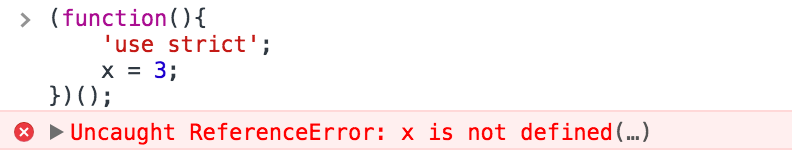
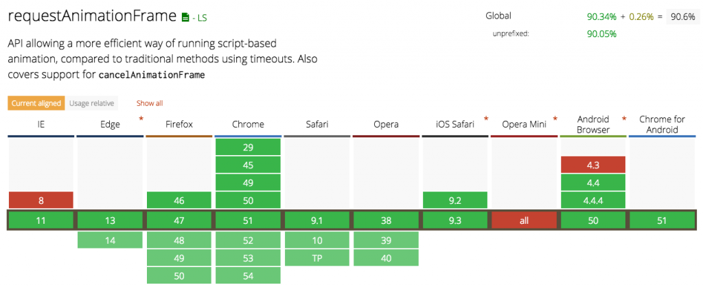
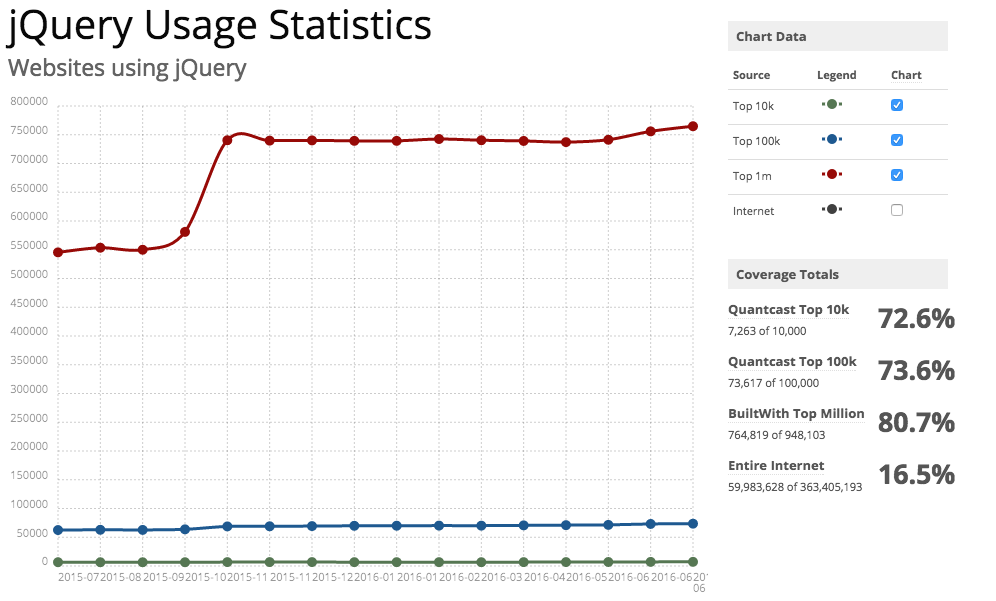

## [WHAT`S NEW INSIDE JQUERY 3.0](https://codebrahma.com/whats-new-jquery-3-0/?utm_source=javascriptweekly&utm_medium=email)

从jQuery开始统治Web并且一直向良好的方向发展至今已经10年了。过了很长的一段时间，jQuery和它的兼容版本终于在上个月发布了。3.0将它会更加简洁、快速，同时向下兼容。你可以在下载页下载[最新版的jQuery 3.0](http://jquery.com/download/)。同时也值得去看一下[升级指南](http://jquery.com/upgrade-guide/3.0/)和[源码](https://code.jquery.com/jquery-3.0.0.js)

在这篇文章中，我将会列出在jQuery 3.0中介绍的新改动中最重要的几点并指导如何去使用它们。

### 1.jQuery 3.0 在严格模式中运行

至今为止，几乎所有的浏览器都支持jQuery 3.0支持的严格模式，3.0已经在内部集成了该指令。



想要你的代码在严格模式中运行吗？别担心，你不需要重写你的jQuery代码。尽管jQuery 3.0是在严格模式中运行的，但是并不强制你的代码也使用严格模式。严格模式和非严格模式的Javascript可以同时存在。

### 2.For...of 循环

jQuery 3.0支持一种新的循环语法：`for...of`。这是[ECMAScript 6](http://es6-features.org/)中的一个新的迭代器。它提供一个更简单的方式去遍历一个可迭代对象，比如Arrays、Maps、Sets。在jQuery 3.0椎间盘买个，`for...of`循环可以替换`$.each(...)`语法。

```js
var items = $('.random-class');

// old jQuery way
$.each(items, function(index, vlaue) {
    // do something
});

// ES6 way
for (let item of items) {
    // do something
};
```

>注意：`for...of`循环只能在支持ECMAScript6的浏览器或者你使用JavaScript编译器比如[Babel](https://babeljs.io/)来执行它

### 3.使用`requestAnimationFrame()`来执行动画

在jQuery3.0中使用`requestAnimationFrame()`API来执行动画。它使动画运行更顺畅，更快，更少的中央处理器密集的动画。这个心的API只在支持它的浏览器中使用。就的浏览器(如IE9)，它使用以前的API作为回退方法来运行动画。如果你想更加了解`RequestAnimationFrame`，可以查看这个[博客](https://css-tricks.com/using-requestanimationframe/)




### 4.使用`escapeSelector()`来规避有特殊意义的字符串

新的`$.escapeSelector()`方法允许你规避一些在CSS选择器中有特殊意义的字符串或者字符。这个方法在一个类的名称或者ID包含一些比如`.`或者`;`等在CSS中有特殊意义的字符的时候是非常有用的。这并不是一个经常发生的问题，但是如果你碰到了一个类似的问题，现在你有一个简单的方法去解决它。

```js
// consider this is your element
<div id="abc.def"></div>

// 上面的元素将不能被选中，因为它会被解析为一个拥有id="abc"并且有一个类名为"def"的元素
$('#abc.def')

// 在jQuery 3.0中它可以这么处理
$('#' + $.escapeSelector('abc.def'))
```

### 5.对于XSS攻击提供额外的保护措施

jQuery 3.0添加一个额外的安全层来防御[Cross-Site-Scripting(XSS)](https://www.owasp.org/index.php/Cross-site_Scripting_(XSS))。它要求开发者在`$.ajax()`和`$.get()`方法中指定`dataType: 'script'`。换句话说，当在一个域上进行跨域请求的时候，你现在必须在选项中显示的声明这个选项

>Cross-Site Scripting (XSS) attacks are a type of injection, in which malicious scripts are injected into otherwise benign and trusted web sites. XSS attacks occur when an attacker uses a web application to send malicious code, generally in the form of a browser side script, to a different end user. Flaws that allow these attacks to succeed are quite widespread and occur anywhere a web application uses input from a user within the output it generates without validating or encoding it.

### 6.移除`.ajax()`中特定情况下的延迟方法

从`$.ajax()`返回的`jqXHR`对象是一个`Deferred`。在以前，它有三个额外的方法对应参数中的`success`、`error`和`complete`。在jQuery 3.0中这些方法已经被移除了。现在你可以使用`Deferred`的标准方法`done`、`fail`和`always`，或者使用新的`then`和`catch`方法。

### 7.`.get()`和`.post()`的新特征

jQuery 3.0给`.post()`和`.get()`方法增加了一个新的特征。通过添加一个`settings`参数来把它们附加到`$.ajax()`中，它是一个可以有很多属性的对象，可以把它传递给`$.ajax()`。把同一个`settings`对象传递给`$.get()`和`$.post()`与传递给`$.ajax()`唯一的不同之处是`property`方法总是被忽略的。

```js
// HTTP Get
$.get([settings])

// HTTP Post
$.post([settings])
```

### 8.SVG支持类属性处理

jQuery一直没有完全的支持SVG，这个在3.0中也没有发生改变。jQuery中处理CSS类名的`.addClass()`和`.hasClass()`现在也同样可以用来处理SVG元素。这意味着你可以在SVG中用jquery来查找类名，然后通过类名来改变它的样式。

### 9.简化show/hide的逻辑

这是你应该要记住一件重要的改变。从现在开始，`.show()`、`.hide()`和`.toggle()`方法将会注重行内样式而不是计算样式。该文档声称最重要的结果如下：

>因为，断开连接的元素将不再被认为是隐藏的，除非他们有行内样式`display: none;`，因此`.toggle()`从3.0开始将不会把它们划分为连接元素。

如果你想更好的去理解`show/hide`的逻辑，你可以参考jQuery组织创建的[table](https://docs.google.com/spreadsheets/d/1UaISjcS3UMxVJ7eSBIXtK-jqF8Grl67w640peCqlkoc/edit)或者阅读关于它非常有意思的[Github discussion](https://github.com/jquery/jquery/issues/2854)


### 10.`.width()`和`.height()`的取值更精准

jQuery的`width()`、`height()`和其他所有相关的方法在过去返回的是四舍五入后的值。jQuery 3.0中修复，你会得到更准确的结果(即一个浮点数)。这是一个非常好的改进，有时候，用户确实想要需要一个精准的值来布局。

### 11.弃用`.bind()`和`.delegate()`方法

jQuery 1.7提出用`.on()`方法来绑定事件处理。jQuery 3.0弃用`.bind()`、`.unbind()`、`.delegate()`和`.undelegate()`方法，这些方法在未来可能会被完全移除。你可以在你的项目中使用`.on()`和`.off()`方法，这样你就不用担心新版本的发布。

### 结语

很多人认为jQuery已经死了，在现代网络中已经没有立足之地了。然而，它的发展仍在继续，其统计(前百万的网站中的78.5％都在使用)也反驳了这些说法。



在这篇文章中，我已经和你了解过了jQuery 3.0中重大的改动。你可能已经发现了，这个版本是不会破坏任何现有项目。继续使用jQuery,并且少些，多做。

### 结尾

>原文地址:[https://codebrahma.com/whats-new-jquery-3-0/?utm_source=javascriptweekly&utm_medium=email](https://codebrahma.com/whats-new-jquery-3-0/?utm_source=javascriptweekly&utm_medium=email)
>作者:Balram Khichar
